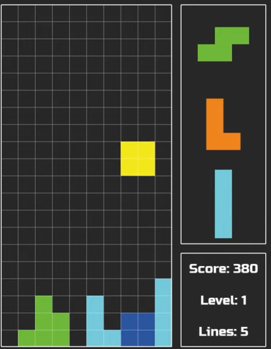
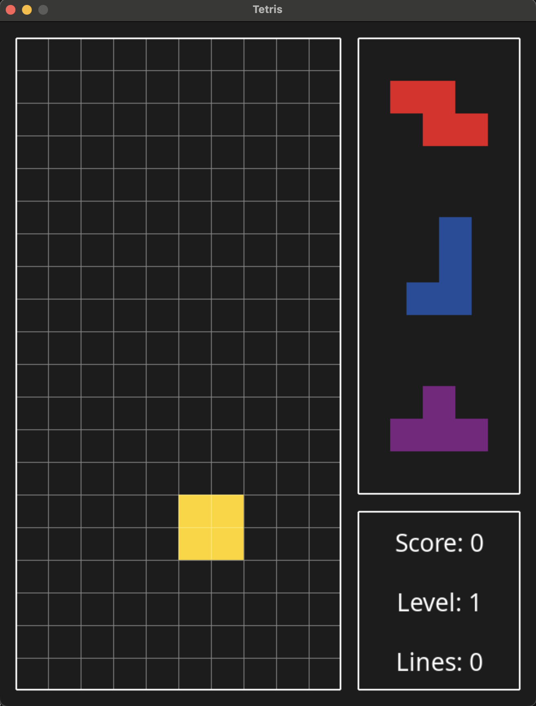

:warning: Everything between << >> needs to be replaced (remove << >> after replacing)

# Tetris Game
## CS110 Final Project  Fall, 2024

## Team Members

Cheng Jie Yau

***

## Project Description

Clone of the tetris game that will include features for score tracking, lines mades, viewing upcoming blocks and level counter. The fall speed of the blocks will also increase as the level increases. The gui design will look similar to that of the image provided in assets.

***    

## GUI Design

### Initial Design

### Final Design

## Program Design

### Features

1. Pause Menu
2. Game Over Screen
3. Score Tracker
4. Line Counter
5. Block Preview

### Classes
Controller
Preview
Game
Score
Timer
Tetromino
-

## ATP

| Step                 |Procedure             |Expected Results                   |
|----------------------|:--------------------:|----------------------------------:|
|  1                   | Run Counter Program  |GUI window appears with count = 0  |
|  2                   | click count button   | display changes to count = 1      |
etc...
